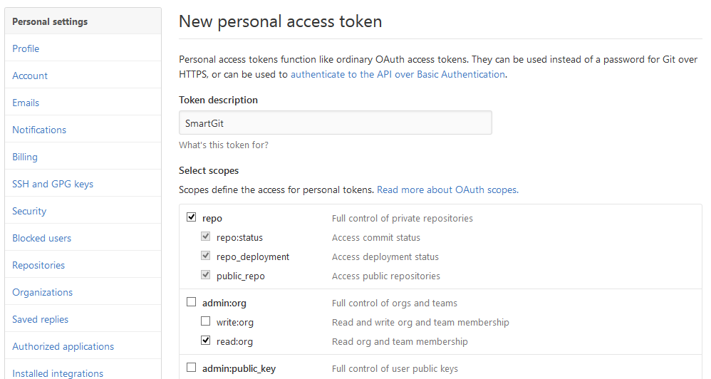
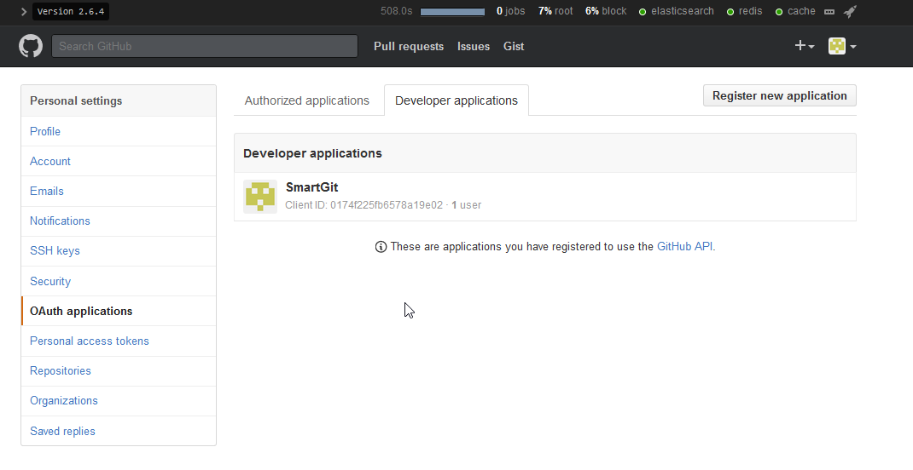
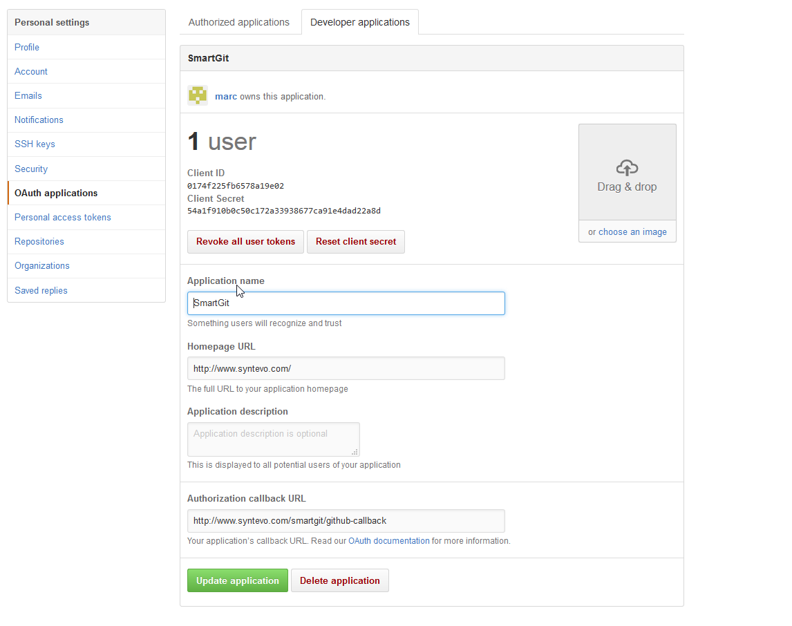

# GitHub Enterprise Integration

Authenticating to a GitHub Enterprise instance is slightly different
than to *github.com* due to the nature of *OAuth*. Basically you have
two options:

-   using **Personal Access Tokens**: this approach can be performed by
    an individual user without needing administrative rights for the
    GitHub Enterprise instance. It's recommended if only a small number
    of your GitHub Enterprise users are using SmartGit
-   configuring a **Developer Application**: this approach requires
    administrative rights for the GitHub Enterprise instance and changes
    to the [SmartGit System Properties](System-Properties.md) (which can be
    done on an administrative level for all users, too). It's
    recommended if you have a large number of SmartGit users.

# Personal Access Token

Personal access tokens are working for GitHub Enterprise as well as
for *github.com*. To create a personal access token, go to
your **Account** settings and select **Personal Access Tokens**.
Invoke **Generate New Token**, enter `SmartGit` for the **Token
Description** and for **Select scopes** select the `repo` scope and
the `read:org` scope.



 

After confirming with **Generate Token**, you will see the new token in
your list of tokens. Copy the token to the clipboard and paste it into
the **Token** field of SmartGit's **GitHub** configuration dialog.

# Developer Application

To use SmartGit's *OAuth* authentication with your *GitHub Enterprise*
instance, SmartGit has to be configured as **Developer Application** in
your GitHub Enterprise instance. This can be done by every GitHub
Enterprise user, from the **Personal Settings**, **OAuth Applications**,
**Developer Applications**.



You have to provide an **Application name**, a **Homepage URL** and the
**Authorization callback URL** to which GitHub Enterprise will redirect
during authentication and pass the generated token to.



GitHub will automatically create a **Client ID** and a **Client Secret**
which have to be passed to SmartGit using [system
properties](System-Properties.md) `smartgit.github.enterprise.oauth.id` and
`smartgit.github.enterprise.oauth.secret`. For the example application
from the screenshot, this would be:


``` java
smartgit.github.enterprise.oauth.id=0174f225fb6578a19e02
smartgit.github.enterprise.oauth.secret=54a1f910b0c50c172a33938677ca91e4dad22a8d
```


